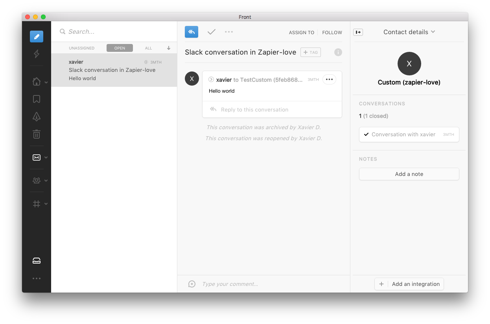
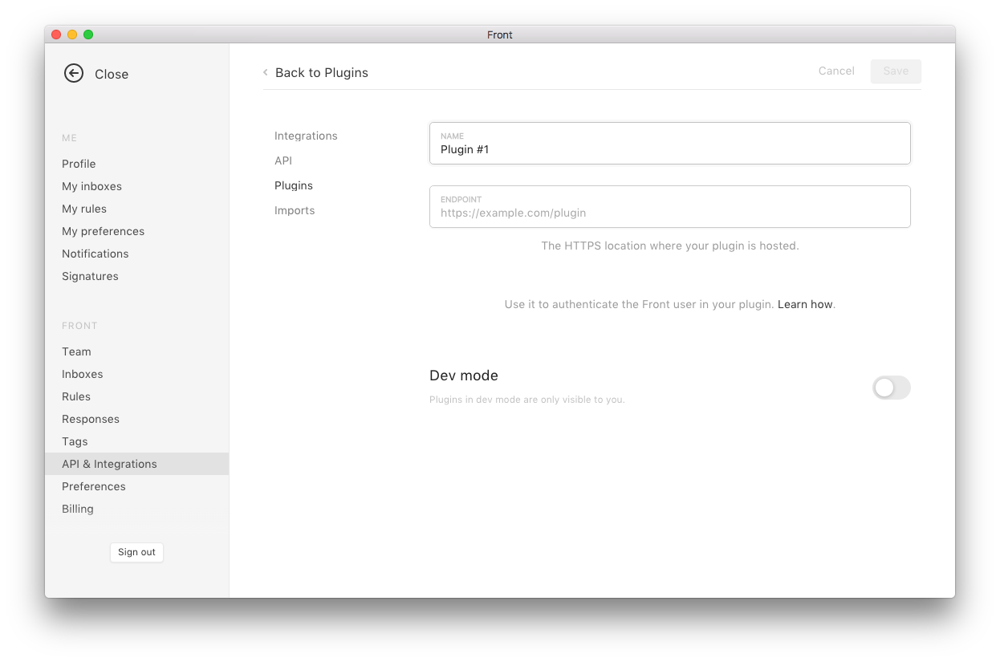
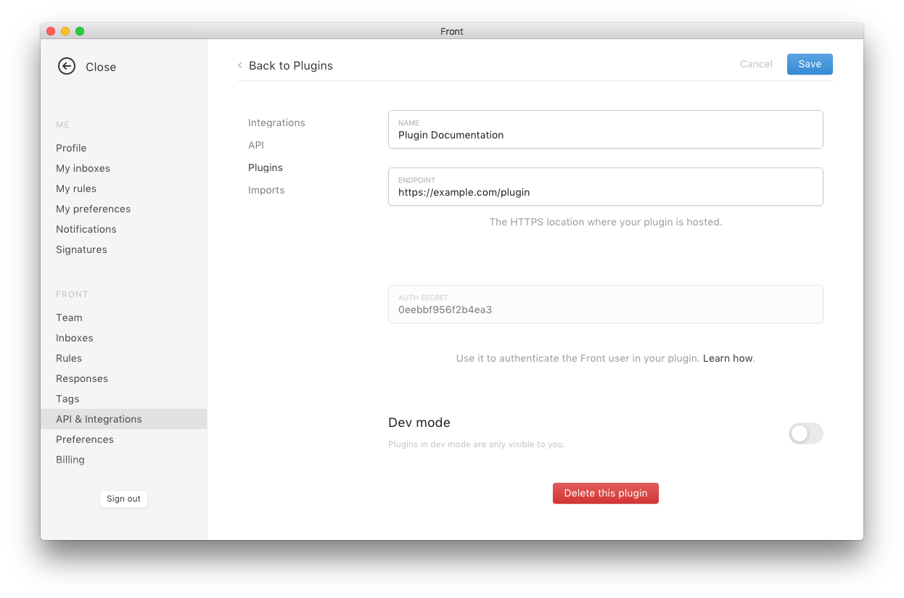

# Introduction

Front supports **plugins**. A plugin is a small web application that can communicate with Front using a JavaScript API. It allows you to extend Front with new features, making it possible to connect it with other tools you use and optimize the workflow of your team:

* Show additional data about your customers, that you can pull from your backend, your knowledge or any other source.
* Take actions directly inside Front on behalf of the user so you can automate a workflow.
* Link or create entries in your CRM, your knowledge base or any other tool.



## Creating a plugin

> You can use any web framework or library you wish: it's just a web page that can communicate with Front.
> It has to be hosted on your servers and include our library. Just add:

```html
<script src="https://dl.frontapp.com/libs/frontjs.min.js"></script>
 ```

You can define the location of your plugin in the settings:



<aside class="warning">
<strong>HTTPS</strong><br>
At the moment, your plugin has to be hosted on an HTTPS domain. You can use <a href="https://ngrok.com/">https://ngrok.com/</a> if you want to quickly serve a local development server over HTTPS.
</aside>

We provide a small sample plugin that shows some basic things you can do using our Javascript API. You can check the code [here](https://github.com/frontapp/frontapp.github.io/).
If you want to test directly, you can even target [https://frontapp.github.io/plugin.html](https://frontapp.github.io/plugin.html) in your plugin settings to see what the basic plugin can do.

## Authentication

It might be desire to ensure that your plugin is indeed requested by Front, especially it displays confidential information.

Front provides a simple way to verify that your plugin is requested by Front. In the settings of your plugin, you will see an authentication secret. This secret will be passed as a query parameter when requesting your plugin.



If you need any help in getting your plugin working, would like more information or a new feature please drop us a line at team@frontapp.com we will be happy to help.
